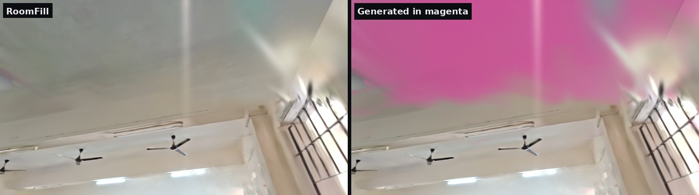

# RoomFill

**Phone video of a room to a metric, navigable 3D scene that fills in what the camera never saw, and
marks every filled part.** Built for HackNex 2026, problem statement HNX26EPS06 (3D Scene Generation from
Blueprints and Room Video), Mode B, with Mode A and both modes combined as bonuses.



## Results on our classroom (tape: 9.23 x 8.88 x 3.5 m)

| | Baseline 3DGS | RoomFill |
|---|---|---|
| Chamfer distance to the measured room | 22.2 cm | **15.5 cm** |
| True surfaces covered within 25 cm | 52% | **90%** |
| Held-out photos, PSNR / SSIM / LPIPS (colour-aligned) | 15.79 / 0.720 / 0.605 | **16.15 / 0.724 / 0.601** |
| Held-out photos, raw PSNR | 10.68 | **11.26** |
| Room dimensions vs tape (with floor plan) | no scale | **3.7% / 4.0%, height 6.4%** |

Full resolution (1588 x 893), 20,000 iterations, same frames for both. The live viewer shows a separate
high-quality display model (base colour only, 3DGS-MCMC, 30k iterations; see write-up 5.3b). Live demo:
https://kiran120627-hub.github.io/roomfill/viewer/?scene=room

Full tables, ablations and limitations: [writeup/WRITEUP.md](writeup/WRITEUP.md) and
[results/room/RESULTS.md](results/room/RESULTS.md). Pitch deck (7 slides, with speaker notes):
[deck/RoomFill_HackNex2026.pptx](deck/RoomFill_HackNex2026.pptx). Judge Q&A:
[writeup/QA_CHEATSHEET.md](writeup/QA_CHEATSHEET.md).

No LLM anywhere: COLMAP, per-scene 3D Gaussian Splatting, LaMa and Depth Anything V2, all run locally (zero API cost).

## What it does
1. Picks the 400 sharpest frames, solves camera poses with COLMAP (sequential + loop-closure pairs).
2. Trains 3D Gaussian Splatting with gsplat.
3. Fits the room shell (floor = lowest strong layer, ceiling = highest, Manhattan walls), robust to
   rows of desks and ceiling beams.
4. Recovers metric scale from a floor plan, or from a camera-height prior (monocular depth is computed
   but gated by a sanity check).
5. Tests every shell texel against all training cameras: seen, seen-through (window / door, never
   painted), or never seen. Only never-seen texels are inpainted (LaMa) and lifted into Gaussians
   tagged `generated` with a `confidence`.
6. Exports metric, gravity-aligned PLY, compact .splat, textured GLB and USD, splits furniture into
   objects, and serves an offline web viewer with an observed / generated toggle.
7. Mode A: parses a floor plan image (walls, door, dimensions) into a 3D model and uses it to scale
   the video reconstruction.

## Run the viewer (no internet needed)
```bash
python viewer/serve.py
```
Open http://localhost:8766/?scene=room. Drag to look, scroll to walk, **G** shows generated regions,
**B** compares with the baseline, **T** is a tape measure (click two points, distance in metres),
**1-3** jump to viewpoints, **M** shows the numbers panel, **R** resets the view, **H** hides the UI.

## Run the pipeline on a new room
Requirements: WSL Ubuntu, NVIDIA GPU, COLMAP, ffmpeg, PyTorch with CUDA, gsplat (built from source),
LaMa via `simple-lama-inpainting`, plus `pycolmap plyfile lpips opencv-python-headless scipy trimesh
transformers usd-core`.
```bash
./run_all.sh myroom data/raw/myroom.mp4 [END_SECONDS]
```
Optional inputs: `data/heldout/*.jpg` (held-out photos), `data/measurements.json` (tape), and
`data/floorplan.jpg` (floor plan).

## Layout
| Path | Contents |
|---|---|
| `scripts/00-11_*.py` | pipeline stages (ingest, SfM, train, shell, scale, completion, geometry, export, report, objects, eval, floor plan, figures) |
| `viewer/` | offline web viewer (three.js + Spark), scenes, local server |
| `results/` | metrics, report, floor plan model, slide figures |
| `writeup/` | write-up, demo script, judge Q&A |
| `deck/` | pitch deck and its generator (`build_deck.js`, pptxgenjs) |
